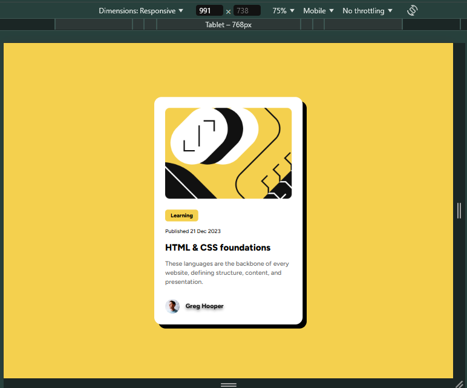
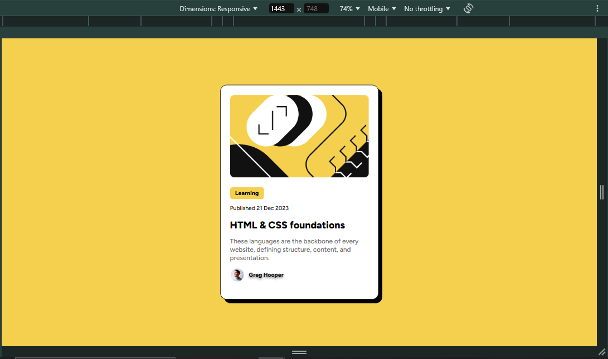

# Frontend Mentor - Blog preview card solution

This is a solution to the [Blog preview card challenge on Frontend Mentor](https://www.frontendmentor.io/challenges/blog-preview-card-ckPaj01IcS). Frontend Mentor challenges help you improve your coding skills by building realistic projects.

## Table of contents

- [Overview](#overview)
  - [Screenshot](#screenshot)
  - [Links](#links)
- [My process](#my-process)
  - [Built with](#built-with)
  - [What I learned](#what-i-learned)
- [Author](#author)

## Overview

### Screenshot

#### Mobile

#### Desktop

### Links

- Live Site URL: [Click here to see the solution](https://frontend-mentor-num-2-blog-card.netlify.app/)

## My process

### Built with

- [React](https://reactjs.org/) - JS library
- Tailwind CSS - For styles
- Figma
- Mobile-first workflow

### What I learned

Definitely **Figma** is a tool that every frontend developer must understand and use. I so much easy to
style the projects when the designers bring us the **Style Guide**

## Author

- Frontend Mentor - [@EdelmiroAnton](https://www.frontendmentor.io/profile/EdelmiroAnton)
- Linkedin - [@EdelmiroAnton](https://www.linkedin.com/in/edelmiro-anton/)
